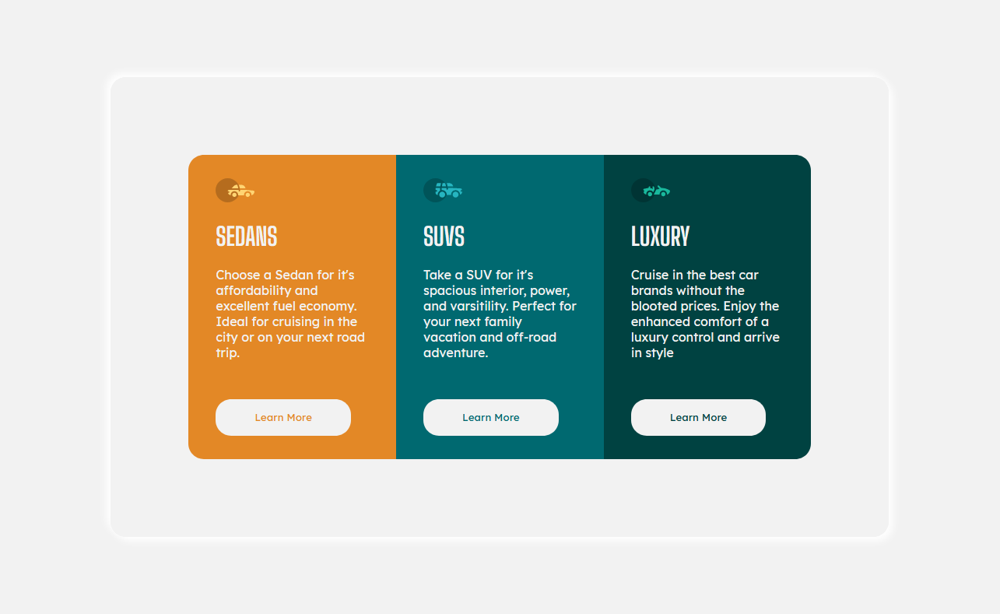
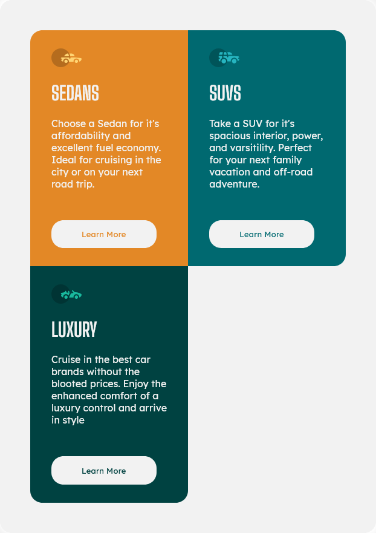

# Frontend Mentor - 3-column preview card component solution

This is a solution to the [3-column preview card component challenge on Frontend Mentor](https://www.frontendmentor.io/challenges/3column-preview-card-component-pH92eAR2-). Frontend Mentor challenges help you improve your coding skills by building realistic projects.

## Table of contents

- [Overview](#overview)
  - [The challenge](#the-challenge)
  - [Screenshot](#screenshot)
  - [Links](#links)
- [My process](#my-process)
  - [Built with](#built-with)
- [Author](#author)

**Note: Delete this note and update the table of contents based on what sections you keep.**

## Overview

### The challenge

Users should be able to:

- View the optimal layout depending on their device's screen size

### Screenshot

- Web view
  
- Tab view
  
- Phone view
  

### Links

- Solution URL: [Github](https://github.com/Akhlak-Hossain-Jim/3-column-preview-card-component-main)
- Live Site URL: [Github Page](https://akhlak-hossain-jim.github.io/3-column-preview-card-component-main/)

## My process

### Built with

- Semantic HTML5 markup
- CSS custom properties
- Flexbox
- CSS Grid

## Author

- Website - [Akhlak Hossain Jim](http://akhlak-hossain-jim.github.io/)
- Frontend Mentor - [@Akhlak-Hossain-Jim](https://www.frontendmentor.io/profile/Akhlak-Hossain-Jim)
- Twitter - [@ahossainjim](https://twitter.com/ahossainjim)
